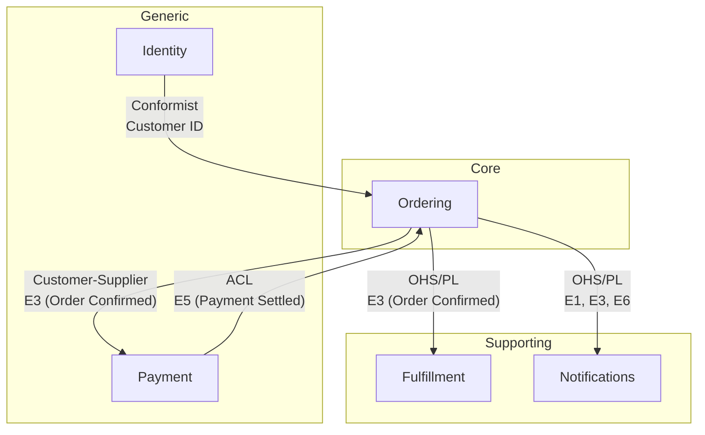

# DDD Step 5: Connect (Context Mapping)

Define the relationships between bounded contexts using standard context mapping patterns. Identify integration points, data flow direction, and upstream/downstream dependencies.

## Prerequisites

- `research/ddd/04-strategy.md` must exist (run `/ddd_strategize` first)
- `research/ddd/03-sub-domains.md` for context boundaries and shared events

## Process Steps

### Step 1: Read Prerequisites

1. Read `research/ddd/04-strategy.md` completely
2. Read `research/ddd/03-sub-domains.md` for context boundaries and shared events
3. Read `research/ddd/02-event-catalog.md` for full building block details
4. Identify all pairs of contexts that share events or have dependencies

### Step 2: Present Context Mapping Patterns

Brief the user on the patterns:

```
## Context Mapping Patterns

For each pair of related contexts, we'll choose a relationship pattern:

| Pattern | Description | When to Use |
|---------|------------|-------------|
| **Partnership** | Both teams evolve together | Tightly coupled, same team |
| **Customer-Supplier** | Upstream serves downstream's needs | Clear dependency direction |
| **Conformist** | Downstream adopts upstream's model | No leverage to negotiate |
| **Anti-Corruption Layer (ACL)** | Downstream translates upstream's model | Protect your model from external influence |
| **Open Host Service (OHS)** | Upstream provides a published API/protocol | Multiple consumers need stable interface |
| **Published Language** | Shared schema/format (often with OHS) | Standard interchange format |
| **Shared Kernel** | Shared code/model between contexts | Small, carefully managed shared subset |
| **Separate Ways** | No integration | Contexts don't need to communicate |

Let's map each relationship.
```

### Step 3: Identify Context Pairs

From the shared events in the sub-domains artifact, identify all context pairs:

```
## Context Relationships to Define

Based on shared events and dependencies, these context pairs need relationship mapping:

1. **[Context A] ↔ [Context B]**
   Shared: E3 (Order Confirmed)
   Direction: [A] publishes → [B] consumes

2. **[Context A] ↔ [Context C]**
   Shared: E5 (Payment Settled)
   Direction: [C] publishes → [A] consumes

Which pattern best describes each relationship?
```

### Step 4: Define Each Relationship Interactively

For each context pair:

```
### [Context A] → [Context B]

**Shared event**: E3 (Order Confirmed)
**Direction**: [A] is upstream (publishes), [B] is downstream (consumes)

Given that:
- [Context A] is [Core/Supporting/Generic]
- [Context B] is [Core/Supporting/Generic]
- [Relevant context about the relationship]

Which pattern fits best?
1. **Customer-Supplier** — [A] serves [B]'s needs, [B] can negotiate
2. **ACL** — [B] translates [A]'s model to protect its own domain language
3. **Conformist** — [B] just uses [A]'s model as-is
4. **OHS + Published Language** — [A] provides a stable API with documented schema
```

Wait for user input on each relationship before proceeding.

### Step 5: Document Data Flow

For each relationship, clarify:
- What data crosses the boundary (events, queries, commands)
- In what format (domain events, REST API, shared database, message queue)
- What translation is needed (ACL mapping, event adapters)

### Step 6: Build Context Map Diagram

Create a Mermaid diagram showing all relationships:



### Step 7: Write Context Map Artifact

Create `research/ddd/05-context-map.md`:

```markdown
---
ddd_step: 5
ddd_step_name: Connect (Context Mapping)
domain: "[Domain Name]"
date: YYYY-MM-DD
status: complete
source: "research/ddd/04-strategy.md"
---

# DDD Context Map: [Domain Name]

## Context Map

` ``mermaid
graph TB
    [Full context map with relationship labels]
` ``

## Relationship Details

### [Context A] → [Context B]
- **Pattern**: [Customer-Supplier / ACL / OHS+PL / Conformist / Partnership / Shared Kernel / Separate Ways]
- **Direction**: [A] upstream → [B] downstream
- **Shared Data**: [Events, queries, or commands crossing the boundary]
- **Integration Mechanism**: [Domain events / REST API / Message queue / Shared DB]
- **Translation Required**: [What ACL or adapter needs to do, if applicable]
- **Rationale**: [Why this pattern was chosen]

### [Context C] → [Context A]
...

## Integration Summary

| Upstream | Downstream | Pattern | Mechanism | Data |
|----------|-----------|---------|-----------|------|
| [Context] | [Context] | [Pattern] | [Mechanism] | [Events/Data] |

## ACL Specifications
[For each Anti-Corruption Layer identified]

### [Context B] ACL for [Context A]
- **Translates**: [Upstream concept] → [Downstream concept]
- **Why**: [Protect domain model from external influence]
- **Key mappings**:
  - [Upstream term] → [Downstream term]

## Open Questions
- [Integration questions remaining]
```

### Step 8: Prompt Next Step

```
Context map written to `research/ddd/05-context-map.md`.

Summary:
- [N] context relationships mapped
- Patterns used: [list patterns]
- [N] ACLs identified

Next step: Run `/ddd_define` to build Bounded Context Canvases and Aggregate Design Canvases for each context.
```

## Important Guidelines

1. **User chooses patterns**: Present options with context, let the user decide
2. **Direction matters**: Upstream publishes, downstream consumes. Get this right
3. **ACL protects core domains**: If a generic/external context feeds into a core domain, an ACL is almost always needed
4. **OHS for multiple consumers**: If an event is consumed by 3+ contexts, the publisher should provide an Open Host Service
5. **Preserve building block IDs**: Continue referencing E1, C1, etc.
6. **Practical integration**: Note the actual mechanism (events, API, queue) — this feeds into implementation plans
