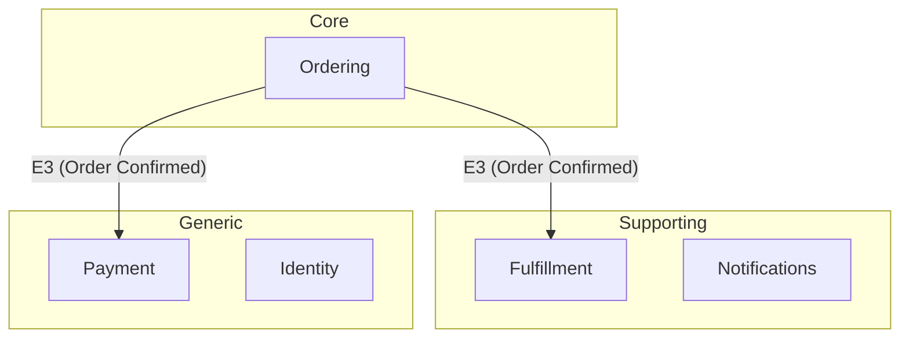

# DDD Step 3: Decompose

Identify bounded context boundaries by analyzing language patterns in the event catalog. Group building blocks into sub-domains based on shared vocabulary, pivotal events, and actor boundaries.

## Prerequisites

- `research/ddd/02-event-catalog.md` must exist (run `/ddd_discover` first)
- `research/ddd/01-alignment.md` should be accessible for business context

## Process Steps

### Step 1: Read Prerequisites

1. Read `research/ddd/02-event-catalog.md` completely
2. Read `research/ddd/01-alignment.md` for business context
3. Understand all building blocks and their relationships before analysis

### Step 2: Spawn Context Analyzer Agent

Spawn a `ddd-context-analyzer` agent:
- Provide paths to both the alignment doc and event catalog
- Instruct it to identify language clusters, pivotal events, and sub-domain classifications
- Wait for results

### Step 3: Present Proposed Boundaries

Present the agent's findings and validate each boundary interactively:

```
## Proposed Sub-domain Boundaries

Based on language analysis of the event catalog, I've identified [N] candidate bounded contexts:

### 1. [Context Name]
**Building blocks**: E1, E3, C1, C4, A1, P1, R1
**Core vocabulary**: [key terms that cluster together]
**Boundary signal**: [why this is a separate context — language shift, pivotal event, actor change]

Does this grouping make sense? Should any building blocks move to a different context?

### 2. [Context Name]
...
```

For each proposed boundary, ask:
- "Does this vocabulary cluster feel cohesive?"
- "Are there building blocks here that feel like they belong elsewhere?"
- "Is this boundary too broad? Should it be split further?"
- "Is this boundary too narrow? Should it merge with another context?"

### Step 4: Validate Pivotal Events

Present pivotal events as boundary markers:

```
## Pivotal Events (Boundary Markers)

These events signal where the business shifts phase:

| Event | From Context | To Context | Why It's Pivotal |
|-------|-------------|-----------|-----------------|
| E3 (Order Confirmed) | Ordering | Fulfillment | Business shifts from sales to logistics |

Are these the right phase transitions?
```

### Step 5: Resolve Ambiguous Groupings

For any building blocks that could belong to multiple contexts:
- Present the ambiguity clearly
- Explain the trade-offs of each placement
- Ask the user to decide
- Document the decision and rationale

### Step 6: Build Sub-domain Map

Create a Mermaid diagram showing the sub-domain structure:



### Step 7: Write Sub-domains Artifact

Create `research/ddd/03-sub-domains.md`:

```markdown
---
ddd_step: 3
ddd_step_name: Decompose
domain: "[Domain Name]"
date: YYYY-MM-DD
status: complete
source: "research/ddd/02-event-catalog.md"
---

# DDD Sub-domains: [Domain Name]

## Sub-domain Map

` ``mermaid
graph TB
    subgraph Core
        [Core contexts]
    end
    subgraph Supporting
        [Supporting contexts]
    end
    subgraph Generic
        [Generic contexts]
    end
    [Relationships between contexts via shared events]
` ``

## Bounded Contexts

### [Context Name]
- **Classification**: Core / Supporting / Generic
- **Building Blocks**: E1, E3, C1, C4, A1, P1, R1
- **Core Vocabulary**: [terms]
- **Boundary Signals**: [why this is a separate context]
- **Aggregates**: [preliminary aggregate groupings within this context]

### [Context Name]
...

## Pivotal Events
| Event | From Context | To Context | Boundary Signal |
|-------|-------------|-----------|-----------------|
| [Event ID and Name] | [Source] | [Target] | [Why pivotal] |

## Language Shifts
| Term | Meaning in [Context A] | Meaning in [Context B] |
|------|----------------------|----------------------|
| [Term] | [Definition A] | [Definition B] |

## Boundary Decisions
| Decision | Options Considered | Chosen | Rationale |
|----------|-------------------|--------|-----------|
| [Where to place X] | [Context A vs B] | [Chosen] | [Why] |

## Open Questions
- [Unresolved boundary questions]
```

### Step 8: Prompt Next Step

```
Sub-domain map written to `research/ddd/03-sub-domains.md`.

Summary:
- [N] bounded contexts identified: [N] core, [N] supporting, [N] generic
- [N] pivotal events marking boundaries
- [N] boundary decisions documented

Next step: Run `/ddd_strategize` to classify sub-domains on the Core Domain Chart and make strategic investment decisions.
```

## Important Guidelines

1. **Language is the primary signal**: Shared vocabulary = same context. Different meanings for same word = different contexts
2. **Validate each boundary individually**: Don't present all boundaries as a done deal
3. **Pivotal events are the strongest markers**: Business phase transitions almost always indicate context boundaries
4. **Don't force symmetry**: Contexts can be vastly different sizes
5. **Preserve building block IDs**: Use E1, C1, A1, P1, R1 from the event catalog throughout
6. **Preliminary classifications only**: Core/supporting/generic classifications here are initial — `/ddd_strategize` does the full analysis
