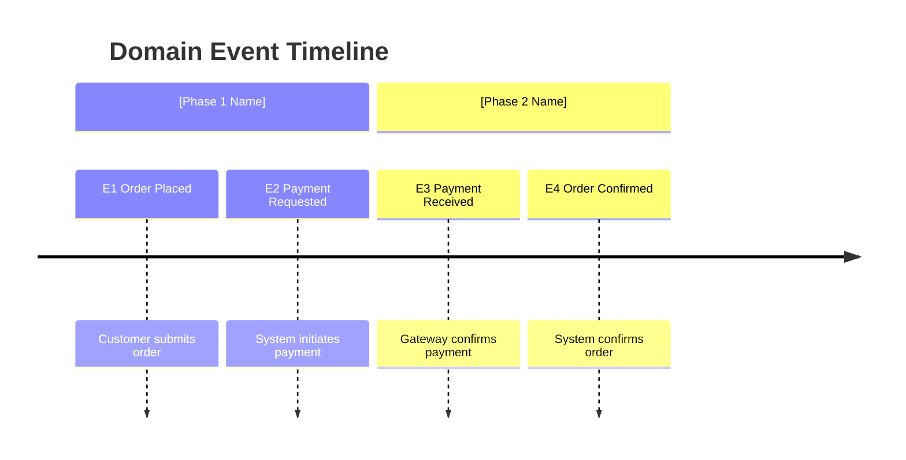
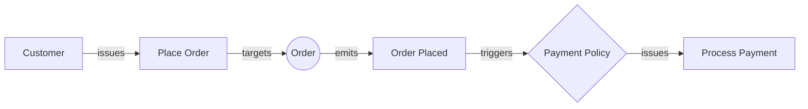

# DDD Step 2: Discover (EventStorming)

Perform structured EventStorming to extract domain building blocks from your requirements. Walk through the domain timeline interactively, identifying events, commands, actors, policies, and read models.

## Prerequisites

- `research/ddd/01-alignment.md` must exist (run `/ddd_align` first)
- Original PRD or source material should be accessible

## Process Steps

### Step 1: Read Prerequisites

1. Read `research/ddd/01-alignment.md` completely
2. Read the original PRD (from the `source` field in alignment frontmatter)
3. Understand the business context, actors, and workflows before spawning agents

### Step 2: Spawn Event Discovery Agent

Spawn a `ddd-event-discoverer` agent:
- Provide it with the alignment doc path and original PRD path
- Instruct it to extract all building blocks with IDs
- Wait for results

### Step 3: Interactive Event Timeline Review

Present the discovered building blocks to the user and walk through them:

```
## EventStorming Results

I've identified the following domain building blocks:

### Event Timeline
[Present events in chronological order of the business flow]

1. **E1: [Event Name]** — [description]
   - Triggered by: C1 ([Command]) from A1 ([Actor])
2. **E2: [Event Name]** — [description]
   - Triggered by: P1 ([Policy]) reacting to E1

### Gaps Found
- [List gaps identified by the agent]

---

Let's walk through this timeline together:

**Starting with the first event flow:**
A1 ([Actor]) → C1 ([Command]) → E1 ([Event])

Does this accurately represent how the process begins?
```

For each event flow, ask:
- "Is this the right trigger for this event?"
- "What happens if this command fails?"
- "Are there alternative paths I'm missing?"
- "What error events should we add?"

### Step 4: Fill Gaps Interactively

For each gap identified:
- Present the gap clearly
- Ask the user to fill it or confirm it's out of scope
- Add new building blocks with sequential IDs
- Explicitly add error/failure events (e.g., "Payment Failed", "Validation Rejected")

### Step 5: Build Mermaid Diagrams

Create two types of diagrams from the finalized building blocks:

**Timeline diagram** showing the chronological flow:


**Event flow diagrams** showing actor→command→aggregate→event→policy chains:


### Step 6: Write Event Catalog Artifact

Create `research/ddd/02-event-catalog.md`:

```markdown
---
ddd_step: 2
ddd_step_name: Discover (EventStorming)
domain: "[Domain Name]"
date: YYYY-MM-DD
status: complete
source: "research/ddd/01-alignment.md"
---

# DDD Event Catalog: [Domain Name]

## Event Timeline

` ``mermaid
timeline
    title [Domain Name] Event Timeline
    section [Phase 1]
        [Events in this phase]
    section [Phase 2]
        [Events in this phase]
` ``

## Event Flows

` ``mermaid
graph LR
    [Actor→Command→Aggregate→Event→Policy chains]
` ``

## Building Blocks

### Events
| ID | Event Name | Description | Triggered By | Phase |
|----|-----------|-------------|-------------|-------|
| E1 | [Name] | [Description] | C1 | [Phase] |

### Commands
| ID | Command Name | Description | Issued By | Produces | Target Aggregate |
|----|-------------|-------------|-----------|----------|-----------------|
| C1 | [Name] | [Description] | A1 | E1 | [Aggregate] |

### Actors
| ID | Actor | Type | Commands |
|----|-------|------|----------|
| A1 | [Name] | Human/External System | C1, C3 |

### Policies
| ID | Policy Name | Trigger | Action |
|----|------------|---------|--------|
| P1 | [Name] | E1 | C2 |

### Read Models
| ID | Read Model | Used By | Key Data |
|----|-----------|---------|----------|
| R1 | [Name] | A1 | [Data fields] |

## Aggregates (Preliminary)
| Name | Commands Handled | Events Produced |
|------|-----------------|-----------------|
| [Name] | C1, C4 | E1, E3 |

## Resolved Gaps
- [Gap that was resolved during interactive review, with resolution]

## Remaining Open Questions
- [Questions still unresolved]
```

### Step 7: Prompt Next Step

```
Event catalog written to `research/ddd/02-event-catalog.md`.

Summary:
- [N] events, [N] commands, [N] actors, [N] policies, [N] read models identified
- [N] gaps resolved, [N] open questions remaining

Next step: Run `/ddd_decompose` to identify bounded context boundaries from language patterns in the event catalog.
```

## Important Guidelines

1. **Walk through events chronologically**: Don't dump the whole catalog at once — go flow by flow
2. **Always ask about failure paths**: Every command can fail. Every external system can be unavailable
3. **Maintain ID continuity**: IDs assigned here (E1, C1, etc.) carry through ALL subsequent artifacts
4. **Past tense for events, imperative for commands**: Enforce grammar consistency
5. **Preliminary aggregates only**: Note likely aggregate groupings but don't commit — decomposition comes next
6. **Mermaid diagrams must be valid**: Test syntax before writing to artifact
