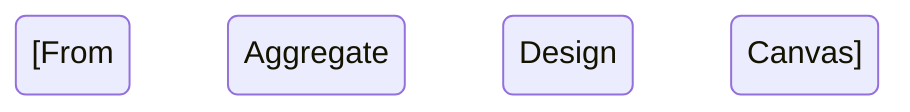

# DDD Step 8: Plan (DDD to Implementation)

Ultrathink about the translation from domain model to implementation. Consider how aggregates map to code structures, how events flow through infrastructure, and how to phase work for incremental delivery.

Convert all DDD discovery artifacts into concrete implementation plans compatible with `/implement_plan`. Produce one plan per bounded context, ordered by strategic priority.

## Prerequisites

- ALL DDD artifacts must exist:
  - `research/ddd/01-alignment.md`
  - `research/ddd/02-event-catalog.md`
  - `research/ddd/03-sub-domains.md`
  - `research/ddd/04-strategy.md`
  - `research/ddd/05-context-map.md`
  - `research/ddd/06-canvases.md`

## Process Steps

### Step 1: Read All Artifacts

Read ALL six DDD artifacts completely. The plan must synthesize the entire discovery chain.

### Step 2: Determine Implementation Sequence

From `04-strategy.md`, establish the order:
1. **Core contexts first** — highest business value, deepest modeling
2. **Supporting contexts that enable core** — dependencies of core contexts
3. **Generic contexts last** — simplest, often third-party integration

Present the proposed sequence:

```
## Implementation Sequence

Based on strategic classification and context dependencies:

| Order | Context | Classification | Architecture | Rationale |
|-------|---------|---------------|-------------|-----------|
| 1 | [Context] | Core | CQRS/ES | Highest business value, no dependencies |
| 2 | [Context] | Supporting | Rich Domain | Enables core context via [events] |
| 3 | [Context] | Generic | CRUD/3rd-party | Commodity, implement last |

Does this sequence make sense? Any ordering changes needed?
```

### Step 3: Map DDD Artifacts to Plan Sections

Use this mapping for each context's plan:

| DDD Artifact | Plan Section |
|-------------|-------------|
| Alignment: value props + constraints | Overview, Desired End State, What We're NOT Doing |
| Event Catalog: events + commands | Domain model phase content |
| Sub-domains: context boundaries | Implementation scope per plan |
| Strategy: classification + architecture | Architecture decisions, pattern choices |
| Context Map: relationships + ACLs | Integration phases, ACL implementation |
| BC Canvas: ubiquitous language, rules | Domain model details, validation rules |
| Aggregate Canvas: invariants, lifecycle | Aggregate implementation, state machines, tests |

### Step 4: Present Plan Strategy Per Context

For each context (in implementation order):

```
## Plan: [Context Name]

**Architecture**: [CQRS/ES / Rich Domain / CRUD]
**Key aggregates**: [from canvases]

### Proposed Phases:
1. **Domain Model** — Aggregates, value objects, domain events
   - [Aggregate 1]: [invariants, commands, events]
   - [Aggregate 2]: [invariants, commands, events]
2. **Application Layer** — Command handlers, query handlers, policies
3. **Infrastructure** — Persistence, event store/database, repositories
4. **Integration** — ACLs, event publishing, API endpoints
5. **Testing** — Unit tests for invariants, integration tests for flows

Does this phasing work for [Context Name]?
```

Wait for confirmation before writing each plan.

### Step 5: Write Implementation Plans

For each bounded context, create `plans/YYYY-MM-DD-ddd-[context-name].md` using the exact `/create_plan` template format:

````markdown
---
date: YYYY-MM-DD
domain: "[Domain Name]"
bounded_context: "[Context Name]"
classification: Core / Supporting / Generic
architecture: CQRS/ES / Rich Domain Model / CRUD
ddd_artifacts: "research/ddd/"
status: ready
---

# [Context Name] Implementation Plan

## Overview
[What we're implementing: the [Context Name] bounded context from DDD discovery.
Architecture: [pattern]. Classification: [core/supporting/generic].]

## Current State Analysis
[What exists now — from codebase research or "greenfield"]

### Key Discoveries:
- Business rules from BC Canvas: [list]
- Aggregate invariants from Aggregate Canvas: [list]
- Integration points from Context Map: [list]

## Desired End State
[Specification of the bounded context fully implemented with:
- All aggregates handling their commands and emitting events
- All invariants enforced
- Integration with [related contexts] via [pattern]
- Ubiquitous language reflected in code]

## What We're NOT Doing
- Other bounded contexts ([list] — separate plans)
- [Out of scope items from alignment]
- [Items marked INSUFFICIENT DATA in canvases — to be resolved separately]

## Implementation Approach
[Architecture pattern and rationale from strategy classification]

## Phase 1: Domain Model

### Overview
Implement aggregates, entities, value objects, and domain events for [Context Name].

### Changes Required:

#### 1. [Aggregate Name] Aggregate
**File**: `src/[context]/domain/[aggregate].{ext}`
**Changes**: Implement aggregate with commands, events, and invariants

**Commands handled**:
- C1 ([Command Name]) → E1 ([Event Name])
- C2 ([Command Name]) → E2 ([Event Name])

**Invariants enforced**:
- [Invariant from Aggregate Design Canvas]
- [Invariant]

**State lifecycle**:


#### 2. Value Objects
**File**: `src/[context]/domain/value-objects.{ext}`
**Changes**: [Value objects identified from ubiquitous language]

#### 3. Domain Events
**File**: `src/[context]/domain/events.{ext}`
**Changes**: [Events from event catalog assigned to this context]

### Success Criteria:

#### Automated Verification:
- [ ] Domain model compiles/type-checks
- [ ] Unit tests for each aggregate invariant pass
- [ ] Unit tests for state lifecycle transitions pass

#### Manual Verification:
- [ ] Ubiquitous language terms match code naming
- [ ] Aggregate boundaries feel right (not too large, not too small)

**Implementation Note**: After automated verification passes, pause for manual confirmation before next phase.

---

## Phase 2: Application Layer

### Overview
Implement command handlers, query handlers, and policy handlers.

### Changes Required:

#### 1. Command Handlers
**File**: `src/[context]/application/commands.{ext}`
**Changes**: Handler for each command in this context

#### 2. Policy Handlers
**File**: `src/[context]/application/policies.{ext}`
**Changes**: [Policies from event catalog: when E1, then C2]

#### 3. Query Handlers / Read Models
**File**: `src/[context]/application/queries.{ext}`
**Changes**: [Read models from event catalog assigned to this context]

### Success Criteria:

#### Automated Verification:
- [ ] Command handlers process valid commands
- [ ] Policy handlers react to correct events
- [ ] Read models return expected data shape

#### Manual Verification:
- [ ] Command flows match EventStorming sequences
- [ ] Error handling covers failure events

---

## Phase 3: Infrastructure

### Overview
Implement persistence, repositories, and event store/database.

### Changes Required:

#### 1. Repositories
**File**: `src/[context]/infrastructure/repositories.{ext}`

#### 2. Persistence
**File**: `src/[context]/infrastructure/persistence.{ext}`

### Success Criteria:

#### Automated Verification:
- [ ] Integration tests for persistence pass
- [ ] Event store correctly stores and replays events (if CQRS/ES)

#### Manual Verification:
- [ ] Data model matches domain model

---

## Phase 4: Integration

### Overview
Implement context boundary integrations from the context map.

### Changes Required:

#### 1. [ACL / OHS / Event Publisher]
**File**: `src/[context]/integration/[target-context].{ext}`
**Changes**: [From context map relationship details]

### Success Criteria:

#### Automated Verification:
- [ ] Integration tests for cross-context communication pass
- [ ] ACL correctly translates between domain models

#### Manual Verification:
- [ ] Events flow correctly between contexts

---

## Testing Strategy

### Unit Tests:
- Aggregate invariant enforcement (from Aggregate Design Canvas correctness criteria)
- State lifecycle transitions
- Value object equality and validation

### Integration Tests:
- Command → Event → Policy chains (from EventStorming flows)
- Cross-context event propagation (from Context Map)

### Manual Testing Steps:
1. Walk through each EventStorming flow end-to-end
2. Verify ubiquitous language in API/UI matches canvases

## References
- DDD Artifacts: `research/ddd/`
- Alignment: `research/ddd/01-alignment.md`
- Event Catalog: `research/ddd/02-event-catalog.md`
- Context Map: `research/ddd/05-context-map.md`
- Canvases: `research/ddd/06-canvases.md`
````

### Step 6: Present Summary

```
## Implementation Plans Created

| Plan | Context | Architecture | Phases |
|------|---------|-------------|--------|
| `plans/YYYY-MM-DD-ddd-[name].md` | [Context] | [Pattern] | [N] |

**Implementation order**:
1. [First plan] → `/implement_plan plans/YYYY-MM-DD-ddd-[name].md`
2. [Second plan] → after first context is complete
3. [Third plan] → after dependencies met

Each plan is compatible with `/implement_plan`. Start with:
`/implement_plan plans/YYYY-MM-DD-ddd-[first-context].md`
```

## Important Guidelines

1. **One plan per bounded context**: Don't combine contexts into a single plan
2. **Exact `/create_plan` template format**: Plans must be compatible with `/implement_plan`
3. **Architecture matches strategy**: CQRS/ES only for contexts classified as needing it
4. **Phases are incremental and testable**: Each phase has automated + manual verification
5. **Trace everything to DDD artifacts**: Every implementation item should reference its source (E1, C1, canvas, etc.)
6. **Core contexts get detailed plans**: Supporting/generic contexts can be more abbreviated
7. **Plans directory**: Create `plans/` if it doesn't exist
