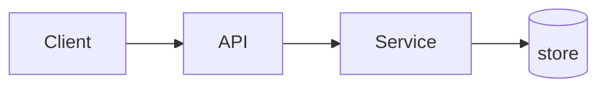

# Tech Spec: <Title>

> One-sentence elevator pitch for the chosen approach.

## Problem

One paragraph. What's broken / missing / needed and why it matters now.

## Scoping Brief

Summary of the framing questions answered (from `references/framing-questions.md`). Only include questions marked load-bearing or answered by the user — omit the noise tier.

### Engineering (Set A)
- **Success metric**: ... (state as *impact* — the outcome, not the technology that delivers it)
- **Scale**: ...
- **SLA / SLO**: ... (concrete, objective terms — uptime %, p95 latency, throughput. Never "performant" or "fast")
- **Consistency**: ...
- **What already exists**: ...
- **Consumers**: ...
- **Scariest failure mode**: ...
- **Timeline / team**: ...
- **12–18mo evolution**: ...
- **Definition of done**: ...

### Learning posture (Set B — include only if answered)
- **Smallest learning test**: ...
- **Real user**: ...
- **Named fear**: ...
- **Simplest possible design**: ...
- **Unvalidated assumptions**: ...
- (others as relevant)

### Buy-vs-build (Set C)
- **One-sentence problem**: "..."
- **Problem category**: <named primitive>
- **Peers at our scale**: <links to 2–3 engineering blog posts>
- **Custom delta vs OSS**: <list>
- **Adopt vs build cost**: <short comparison with numbers>

## Goals & non-goals

State goals as **impact, not implementation**. A goal is the outcome you want; the chosen approach is how you get there. "Minimize outages from deploying new versions" ✅ — "Add Kubernetes" ❌ (that's a tactic with the *why* missing).

**Goals**
- ... (the impact, in the reader's terms)

**Non-goals**
- things explicitly not being solved — used to delineate what's out of scope

## Scope

**In scope**
- ...

**Out of scope**
- ...

## Constraints

- Deadline: ...
- Team / budget: ...
- Must keep working: ...
- Compliance / compatibility: ...

## Candidate approaches considered

For each candidate (2–4 of them). The chosen one is marked ✅.

### 1. <Name> ✅  *(if chosen)*

**Sketch**: one paragraph in plain terms.

**Key tradeoff**: the thing that makes it different from the others.

**Effort**: S / M / L / XL  (or weeks)

**Reversibility**: cheap / medium / hard — one line on backout.

**Risks**:
- ...
- ...

**Why (not) chosen**: one sentence.

### 2. <Name>

...

### 3. <Name>

...

## Chosen approach — high-level design

### Scenario walkthrough

Paint the picture: how the completed system behaves for one real request/user, end to end. A reader should be able to see it working before reading the component inventory. *(Omit for Light specs.)*

1. ...
2. ...

### Components
- **<name>** — what it does, 1 line.
- ...

### Diagram

Use a **Mermaid** block when data flow or component relationships aren't obvious from prose — it lives in the markdown, diffs in review, and any reader can edit it. Prefer text-based (`flowchart` / `sequenceDiagram` / `erDiagram`) over pasted images. *(Optional for Standard; encouraged for Heavy; drop the heading if no diagram adds clarity.)*

### Data
- New entities / tables / schema shifts. Migration *shape* only (not SQL).

### Interfaces
- API / event / CLI surface changes. Named endpoints, not payloads.

### Dependencies
- New libraries, services, infra. Version constraints only if they matter.

### Rollout shape
One sentence: dark-launch / flagged / big-bang / shadow-writes / incremental cutover.

## Operability & risk

*Heavy specs only. Include a sub-section for each dimension where the **penalty for ignoring it is high**; delete the ones that don't apply rather than filling them with "N/A".*

- **Security**: where untrusted/malicious data enters; trust boundary and attack surface this design adds.
- **Privacy**: sensitive data handled; retention, access control, encryption; which policy it complies with.
- **Monitoring / alerting**: how the SLO is measured in production; what events trigger an alert. *("If this goes down, how do we find out?")*
- **Logging**: critical events logged, at what level; sensitive fields excluded.

## Alternatives considered (brief rationale)

Short paragraph per rejected candidate — one sentence on why it lost. Links back to the Candidate section for detail.

## Open questions

Each must have **owner** and **forcing function** (e.g. "before Phase 2 of the plan", "before merge", "by 2026-05-01").

- [ ] Question ... — **owner**: @who — **by**: when
- [ ] ...

### Resolved questions

When an open question is settled, move it here with its resolution — don't delete it. The discussion is the record of *why* the design is the way it is.

- [x] Question ... — **resolved**: <the decision and one line on why>

## Critique resolution

Populated from Step 7 (`references/critique-integration.md`). If critique was skipped, record that here with a reason.

- **Findings**: { blockers: N, material: N, polish: N }
- **Blockers**: (list with how each was resolved — addressed / overridden-with-rationale / accepted-as-tech-debt)
- **Material**: (list with how each was resolved)
- **Polish**: applied silently unless listed

## Handoff

Next step: `/create-plan <this-spec-path>`.

The plan should:
- Treat "Chosen approach — high-level design" as the target architecture.
- Turn each component/interface into phased work.
- Inherit the open questions as plan-level decisions to resolve.
